---

## Projects

**[Cross-Media Recommendation Engine](https://github.com/arnavpodichetty/cross-media-recommendation-engine)**
Matches films, books, anime, games, and music by tone and mood rather than genre tags. Pulls from five APIs, builds LLM taste profiles, runs pgvector similarity search, and returns a plain-language reason for every recommendation.

**[Masquerade](https://github.com/arnavpodichetty/masq)**
Spyfall-style social deduction game with 20+ role categories and real-time lobbies. Playtested across five groups; App Store release in progress.

**[Genius Blurb](https://github.com/arnavpodichetty/genius-blurb)**
Syncs Genius annotations to live Spotify playback, matching lyrics to the current track with word-overlap scoring.

**[Card Game Catalog](https://github.com/arnavpodichetty/card-game-catalog)**
15+ party games with join-code lobbies and no sign-ups required.

**[QR Scanner](https://github.com/arnavpodichetty/QRScanner)**
macOS menu-bar utility that decodes QR codes from a screenshot, paste, or file in one click.

**[Claculator](https://github.com/arnavpodichetty/Claculator)**
A calculator puzzle game where the keypad doesn't do what it says.

---

## Stack

  

---

 

